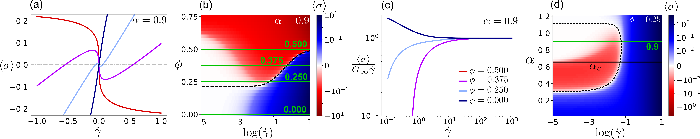

# Two speices active elasto-plastic model
Calculation of the stress in a disordered material made up of active and passive units. The model here is a two species version of the [Hebraud-Lequex (HL) Model](https://journals.aps.org/prl/abstract/10.1103/PhysRevLett.81.2934), which models the flow of very concentrated suspensions of soft particles, e.g. thick paint. The model divies the material into discrete blocks that are much smaller that the system but contain enough particles to capture local interactions, such as particles swapping and chaning position. These blocks are coupled together via interaction rules e.g. rules for stress propagates through the material, which provides a picture for how local events shape large scale features and dyanmics. The HL model makes the simplifying assumption that all blocks are statistically identical, which allows us to easily calculate properties of the average stress in the material in response to some applied strain or forcing. 

## Model
We have a two component material subject to external strain rate $\dot{\gamma}$. The evolution of the stress $\sigma$ is governed by a probability distribution $P_1(\sigma)$ for active blocks and $P_0(\sigma)$ for passive blocks

```math 
\partial_{t}P_k(\sigma,t) = -G_k\dot{\gamma}\partial_{\sigma}P_k(\sigma,t) + D(t)\partial_{\sigma}^2P_k(\sigma,t) - \frac{\theta(|\sigma| - \sigma_{k,c})}{\tau}P_k(\sigma,t) + \delta(\sigma)\phi_k\Gamma(t),
```
where $k = 0,1$, and $\phi_k = \phi + k - 1$, with $0 < \phi < 1$ being the fraction of the system that is active. The first terms on the RHS encodes the elastic response represents advection in stress space of the stress distribution by $G_i\dot{\gamma}$, where $G_0 > 0$ is the elastic modulus of the passive elements, $G_1 < 0$ is the elastic modulus of the passive elements, and $\dot{\gamma}$ is the strain rate. The second term encodes the mechanical noise from stress redistribution in an effective diffusivity $D(t)$. The self-consistency requirement of the model is that the diffusion coefficient is proportional to the overall rate of yielding events in the material, which is given by the plastic activity $\Gamma(t)$
```math
D(t) = \alpha \Gamma(t),

\Gamma(t)\tau = \int\limits_{|\sigma| > \sigma_{0,c}} P_0(\sigma,t) \,d\sigma + \int\limits_{|\sigma| > \sigma_{1,c}} P_1(\sigma,t) \,d\sigma,
```
where $\tau$ is the time scale of a single plastic event. The parameter $\alpha$ depends on the microscopic properties of the material and controls the transition from a fluid to a yield stress material. The third and fourth terms on the RHS of \eqref{eq:probevol} determine what happens when the stress in a block exceeds $\sigma_{k,c}$. The third term corresponds to the removal of over-stressed blocks over a time scale $\tau$, where $\theta(x) = 1$ for $x > 0$ and is zero otherwise. The fourth term corresponds to the addition of new elements at zero stress at the same rate that yield events are occurring - this rate is $\phi_k\Gamma(t)$. 

The code here calculates solutions to the stationary solution $\partial_tP_k = 0$, which gives rise to a second order differential equation for each block type, which can be solved assuming a fixed but unknown $D$. The active and passive blocks are coupled by the fact that the effective diffusion is constant throughout the material. Once we have solved for $P_k(\sigma)$ in terms of $D$, we require that $\int_{-\infty}^{\infty} (P_0 + P_1) \,d\sigma = 1$, and combine this with the self-consistency requirement to obtain an implicit equation for $D$ (details in paper soon to be available on arXiv). 

## How to use 
Select parameters and run the stress calculation using "run_hl.sh" and use "colmesh..." or "curves..." for analysis. Below are examples of plots that were generated with the code and labelled in [Inkscape](https://inkscape.org/doc/tutorials/basic/tutorial-basic.html).



## Dependencies and Packages
Outside of the packages in the standard python library, you will need these:
- [NumPy](https://numpy.org/) is the standard package for scientific computing with Python
- [SciPy](https://scipy.org/) provides higher level scientific computing - this project uses [fsolve](https://docs.scipy.org/doc/scipy/reference/generated/scipy.optimize.fsolve.html), which finds solutions to non-linear equations based on an inital guess 
- [Matplotlib](https://matplotlib.org/) is a comprehensive library for creating static, animated, and interactive visualizations in Python.


